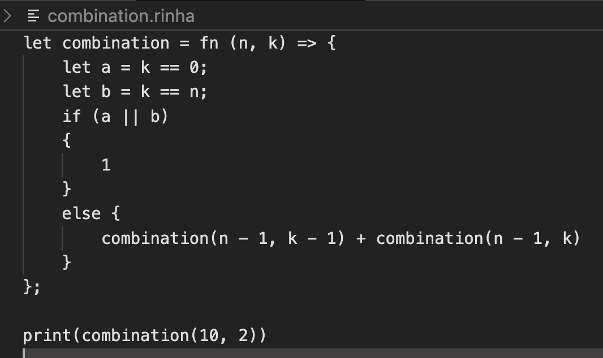
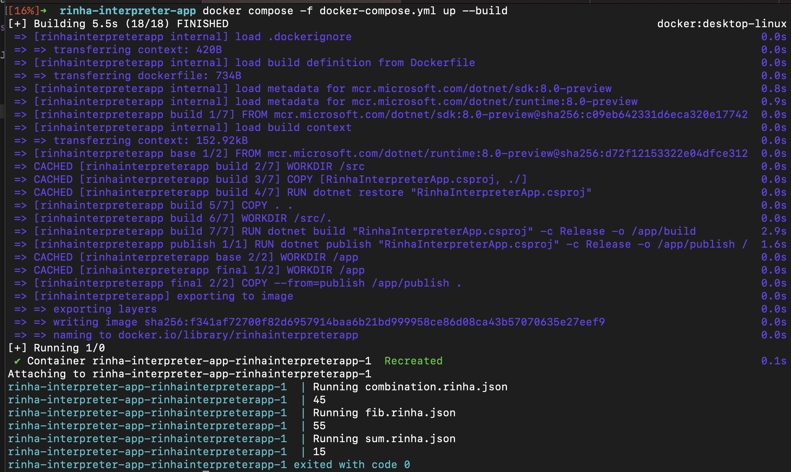

## Rinha Interpreter App

O pior interpretador da rinhaLang feito em C# de todos os tempos da última semana. Testado apenas para os casos mais básicos. Feito com o pé com poucas horas de dedicação. Não devo investir mais tempo, bugs permanecerão. =D

Parece que funcionou para o os algoritmos de fib, sum e combination. As implementações estão na pasta *rinha*.



### Executar o interpretador no docker

Monta a pasta *source* em */var/rinha* e executa dos os arquivos *.rinha.json

```bash
docker compose -f docker-compose.yml up --build
```



### Executar local

Executa o interpretador para todos os arquivos source/*.rinha.json

```bash
dotnet build RinhaInterpreterApp.csproj      
dotnet run
```

